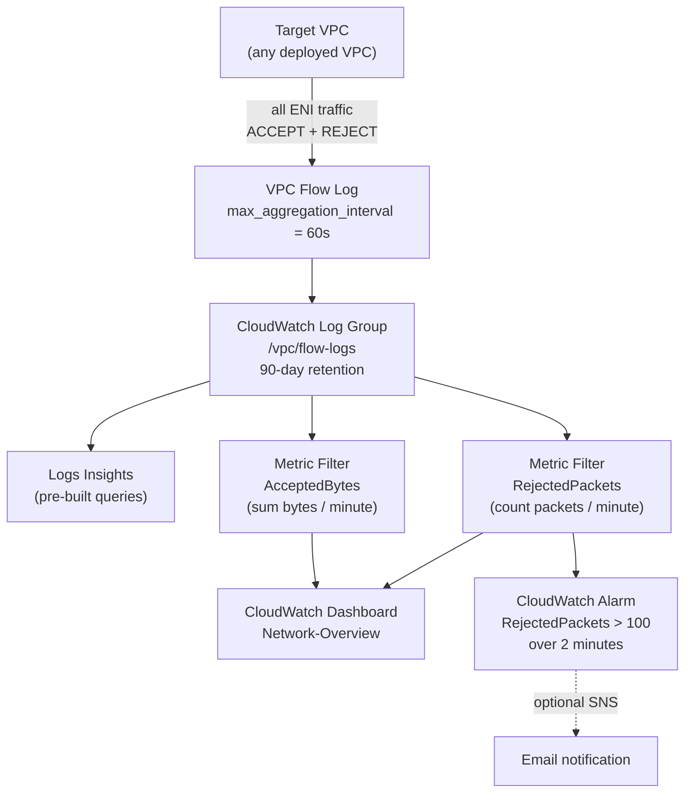

# Architecture

## Flow log collection + analysis path

## Why 60s aggregation

The AWS default for VPC Flow Logs `max_aggregation_interval` is **600 seconds (10 minutes)**. This means a flow log entry can take up to 10 minutes to appear in CloudWatch — too slow for triaging an active incident.

Setting it to **60s** brings first-data-visible latency down to roughly 2 minutes (60s aggregation + ~30-60s delivery latency). The S3/CloudWatch write rate goes up slightly, but the cost increase is negligible relative to the operational benefit.

## Why attach to a real VPC instead of a test VPC

The `vpc_id` variable lets the same module attach to an existing busy VPC instead of creating an empty test one. Pointed at the BGP lab's cloud router VPC, the dashboard immediately captures real BGP keepalives, SSM heartbeats, Lambda invocations, and internet scanner REJECTs — meaningful traffic vs. empty graphs.

This is the right deployment pattern in production: observability gets applied to actual workloads, not isolated demo environments.

## Logs Insights queries available

Pre-built queries in [`queries/`](../queries/):

| Query | Purpose |
|---|---|
| Top talkers | Find the source IPs sending the most bytes |
| Rejected connections | Surface SG misconfigurations or scan activity |
| SSH brute force | Detect repeated REJECT attempts on port 22 |
| Connection trace | Filter all flow records for a specific src/dst pair |
