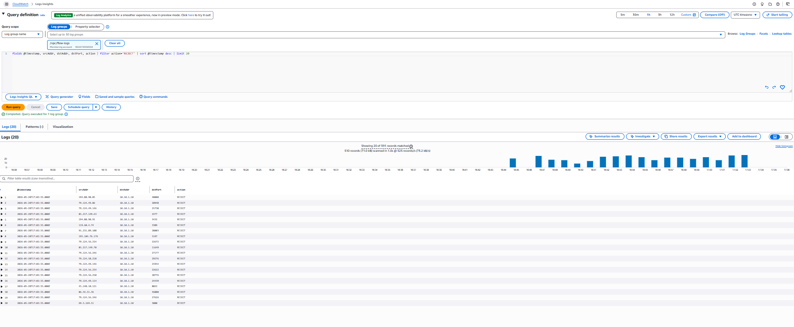

# AWS Network Monitoring & Observability


Network observability infrastructure for AWS VPCs: VPC Flow Logs captured to CloudWatch Logs, a CloudWatch dashboard showing traffic patterns, and alarms for anomalous behavior. Includes a set of Logs Insights queries for real troubleshooting scenarios — the kind of thing you'd use during an actual incident.

> ### Deployed against a real workload
>
> Pointed at a production VPC (the BGP lab's cloud router subnet), the dashboard captured real accepted traffic, internet-scanner REJECT records, and the CloudWatch alarm tracking rejected-packet-rate. **`max_aggregation_interval=60s` overrides the AWS default of 600s** to surface incidents in ~2 minutes instead of 10+.
>
> 
>
> Logs Insights surfacing 391 REJECT records from internet scanners hitting the public IP:
>
> 
>
> CloudWatch alarm armed and tracking `RejectedPackets > 100` over 2 minutes:
>
> 
>
> Supporting captures (raw flow log JSON, AWS describes, architecture): [`Documentation/`](Documentation/)

## Repository Tour

- **[`terraform/`](terraform/)** — flow log infra, IAM, CloudWatch dashboard, metric filters, alarm
- **[`queries/`](queries/)** — pre-built Logs Insights queries for triage scenarios (top talkers, REJECT scan detection, brute-force)
- **[`Documentation/`](Documentation/)** — deployment evidence, dashboard captures, architecture

## The Problem

Building a network is the easy part. Knowing what's happening on it is the hard part. In production, you need answers to questions like:

- Is traffic being rejected by security groups?
- Which instance is generating unexpected outbound traffic?
- What's the source of this sudden bandwidth spike?
- Did that connection from the internet actually reach my instance?

VPC Flow Logs answer all of these. This lab sets up the infrastructure to collect, query, and alert on flow log data — the network operations layer that turns a demo into something production-ready.

## Architecture


VPC Flow Logs stream from any target VPC into a centralized CloudWatch log group, which feeds two metric filters (Accepted bytes, Rejected packets), a CloudWatch Dashboard, and a CloudWatch Alarm:

| Layer | Component | Purpose |
|---|---|---|
| Source | Target VPC | All ENI traffic is captured by the Flow Log |
| Capture | VPC Flow Log (60s aggregation) | Near-realtime delivery vs AWS default 600s |
| Storage | CloudWatch Log Group `/vpc/flow-logs` | 90-day retention |
| Metric | `AcceptedBytes`, `RejectedPackets` | Filter patterns over the structured fields |
| Visualization | `Network-Overview` Dashboard | Both metrics on one screen |
| Alerting | `vpc-high-rejected-connections` | Fires when rejected packet rate exceeds threshold |

Set `vpc_id` in terraform.tfvars to attach to an existing busy VPC, or leave blank to deploy a standalone test VPC.


*Full diagram: [Documentation/architecture.md](Documentation/architecture.md)*

## What Flow Logs Capture

Each flow log record captures a 10-second aggregated flow:

```
version account-id interface-id srcaddr dstaddr srcport dstport protocol packets bytes start end action log-status
2 123456789 eni-abc12345 10.0.1.5 10.0.2.10 54321 443 6 10 4096 1609459200 1609459210 ACCEPT OK
```

Key fields:
| Field | What it tells you |
|-------|------------------|
| `srcaddr` / `dstaddr` | Source/destination IPs |
| `action` | ACCEPT or REJECT (security group / NACL decision) |
| `protocol` | 6=TCP, 17=UDP, 1=ICMP |
| `bytes` | Traffic volume per flow |
| `interface-id` | Which ENI (maps to a specific instance) |

## CloudWatch Dashboard Metrics

The dashboard (`Network Overview`) shows:

| Widget | Metric | Why it matters |
|--------|--------|----------------|
| Accepted traffic (bytes/min) | Bytes × ACCEPT filter | Baseline normal traffic |
| Rejected traffic (count/min) | Packets × REJECT filter | Unexpected blocks = misconfigured SGs |
| Top talkers | Bytes by srcaddr | Spot anomalous instances |
| Inbound vs outbound | Direction split | Asymmetry can indicate exfiltration |

## Alarms

| Alarm | Threshold | Why |
|-------|-----------|-----|
| High rejected connections | > 100 rejects/min | SG misconfiguration or scan activity |
| Unexpected outbound spike | > 10GB/hr | Potential data exfiltration |
| SSH rejected | > 10 rejects/min from same IP | Brute force attempt |

## Prerequisites

- AWS account
- Terraform >= 1.5
- AWS CLI configured
- An existing VPC ID to attach Flow Logs to (or deploy the included test VPC)

## Quick Start

```bash
git clone https://github.com/SalamoneJack/aws-network-monitoring.git
cd aws-network-monitoring/terraform

cp terraform.tfvars.example terraform.tfvars
# Set vpc_id to your target VPC, or leave blank to deploy a test VPC
terraform init
terraform apply
```

## Deployment

### Variables

`terraform/terraform.tfvars.example`:
```hcl
region = "us-east-1"
vpc_id = ""   # Leave blank to create a test VPC, or provide an existing VPC ID
```

### What Gets Created

- CloudWatch Log Group: `/vpc/flow-logs` (90-day retention)
- IAM role allowing VPC Flow Logs to write to CloudWatch
- VPC Flow Log attached to target VPC
- CloudWatch Dashboard: `Network-Overview`
- 3 CloudWatch Metric Filters (ACCEPT, REJECT, bytes)
- 2 CloudWatch Alarms with SNS topic

## Logs Insights Queries

Pre-built queries are in [`queries/`](queries/). Run them in CloudWatch → Logs Insights → select `/vpc/flow-logs`.

### Top Talkers (highest traffic sources)

```
fields srcaddr, bytes
| stats sum(bytes) as totalBytes by srcaddr
| sort totalBytes desc
| limit 20
```

### Rejected Connections (security group blocks)

```
fields srcaddr, dstaddr, dstport, protocol
| filter action = "REJECT"
| stats count(*) as rejectCount by srcaddr, dstaddr, dstport
| sort rejectCount desc
| limit 20
```

### SSH Brute Force Detection

```
fields srcaddr, dstaddr, dstport, action
| filter dstport = 22 and action = "REJECT"
| stats count(*) as attempts by srcaddr
| sort attempts desc
| limit 10
```

### Trace a Specific Connection

```
fields @timestamp, srcaddr, dstaddr, srcport, dstport, action, bytes
| filter srcaddr = "1.2.3.4"
| sort @timestamp asc
```

### High-Volume Flows (potential exfiltration)

```
fields srcaddr, dstaddr, bytes, start, end
| filter bytes > 100000000
| sort bytes desc
| limit 10
```

## Sample Troubleshooting Walkthrough

**Scenario:** Application team reports intermittent connection failures to the database.

1. Run the "Rejected Connections" query
2. Filter for `dstport = 3306` (MySQL) or `dstport = 5432` (PostgreSQL)
3. Check `srcaddr` — is it the app server's IP?
4. If REJECT: the security group or NACL is blocking the connection. Check SG rules on the DB
5. If ACCEPT (but app still fails): the TCP connection reached the DB. Problem is application-layer, not network
6. Check the timestamp range of failures against CloudWatch alarm history

This is the flow log workflow in a real incident. You're narrowing from "network problem?" to "exactly which rule is blocking, from which source."

## Cost

| Resource | Monthly Cost |
|----------|-------------|
| CloudWatch Logs ingestion | ~$0.50/GB |
| CloudWatch Logs storage (90-day) | ~$0.03/GB |
| CloudWatch Dashboard | $3.00/mo (first 3 free) |
| CloudWatch Alarms | $0.10 each |
| **Estimated Total (low traffic lab)** | **~$4/mo** |

Disable flow logs when not actively monitoring to reduce costs.

## Production Considerations

- For high-traffic VPCs, send flow logs to S3 instead of CloudWatch (much cheaper at scale)
- Use Athena to query S3 flow logs with SQL — faster for forensics than Logs Insights
- In a multi-account org, aggregate flow logs to a dedicated security/logging account
- Add GuardDuty — it consumes VPC Flow Logs automatically and adds ML-based threat detection
- For HIPAA: 6-year log retention, CloudTrail, and flow log integrity validation required

## What I Learned

- VPC Flow Logs capture at the ENI level, not the instance level — one instance with multiple ENIs generates multiple log streams
- `REJECT` in a flow log means a security group or NACL blocked the traffic. `ACCEPT` with no response from the application means the network path worked but the app didn't respond — two completely different problems
- The IAM role for Flow Logs needs `logs:CreateLogGroup`, `logs:CreateLogStream`, and `logs:PutLogEvents` — and it needs to trust the `vpc-flow-logs.amazonaws.com` service principal, not EC2
- Flow logs have a ~10-minute delay — they're not real-time. For real-time traffic analysis, you'd use Traffic Mirroring to a packet capture instance

## Related Projects

- [aws-hybrid-vpn-lab](https://github.com/SalamoneJack/aws-hybrid-vpn-lab) — Attach flow logs to the VPN lab VPCs
- [aws-multi-vpc-hub-spoke](https://github.com/SalamoneJack/aws-multi-vpc-hub-spoke) — Monitor each VPC in the hub-spoke topology
- [aws-ha-web-app](https://github.com/SalamoneJack/aws-ha-web-app) — Application-tier traffic monitoring
