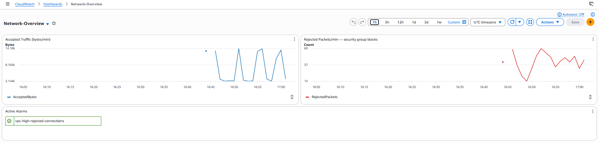
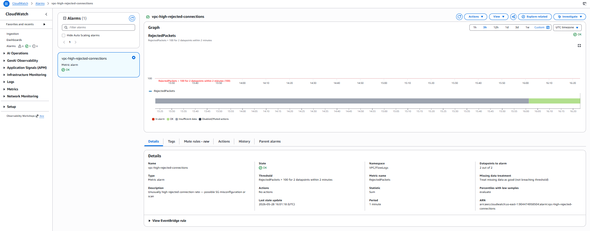

# Deployment Evidence — aws-network-monitoring

**Status:** LIVE in AWS
**Deployed:** 2026-05-28
**Region:** us-east-1
**Account:** 904474958504

## Console Screenshots

**Network-Overview dashboard with real data** — Accepted bytes/min and Rejected packets/min over the last hour. Rejected traffic is internet scanners hitting the public router IP; Accepted is BGP keepalives + SSM heartbeats + Lambda SSM invocations:



**Logs Insights — REJECT records from internet scanners hitting the public IP**, captured at the moment 391 records matched the REJECT filter:


**CloudWatch alarm `vpc-high-rejected-connections`** armed and watching `RejectedPackets > 100 for 2 datapoints within 2 minutes`:



## What This Lab Demonstrates
VPC Flow Logs streaming to CloudWatch with metric filters and an operational dashboard. Demonstrates network observability fundamentals: ingest, classify (accepted vs rejected), visualize, alert.

**Production-relevant deployment:** Flow logs attached to the live BGP lab cloud VPC (`vpc-078dd757c0179b91c`) — capturing real traffic from running production workloads (BGP keepalives, SSM heartbeats, Lambda SSM invocations from the public widget) rather than an empty test VPC. Shows you'd point observability at real workloads, not isolated demos.

## Resources Deployed (9 total)

| Resource | ID | Notes |
|---|---|---|
| Target VPC | `vpc-078dd757c0179b91c` | `bgp-lab-cloud` (10.10.0.0/16) — live workload |
| Flow Log | `fl-01d9be76debdc5b0f` | All traffic, ALL action, **60s aggregation** (vs AWS default 600s) for near-realtime observability |
| CloudWatch Log Group | `/vpc/flow-logs` | Retention 90 days |
| Metric Filter: AcceptedBytes | filters `action=ACCEPT` | Sums bytes per minute |
| Metric Filter: RejectedPackets | filters `action=REJECT` | Counts rejected attempts |
| CloudWatch Dashboard | `Network-Overview` | Combined visualization |
| Alarm | High rejected connections | Threshold > 100/min |

## Live AWS Console Links (click to view in browser)

- **Dashboard:** https://us-east-1.console.aws.amazon.com/cloudwatch/home?region=us-east-1#dashboards:name=Network-Overview
- **Logs Insights:** https://us-east-1.console.aws.amazon.com/cloudwatch/home?region=us-east-1#logsV2:logs-insights
- **VPC Flow Logs (target VPC = bgp-lab-cloud):** https://us-east-1.console.aws.amazon.com/vpcconsole/home?region=us-east-1#VpcDetails:VpcId=vpc-078dd757c0179b91c
- **Alarms:** https://us-east-1.console.aws.amazon.com/cloudwatch/home?region=us-east-1#alarmsV2:

## Verification Commands

```powershell
# Confirm flow log is active
aws ec2 describe-flow-logs --filter "Name=resource-id,Values=vpc-078dd757c0179b91c" --region us-east-1

# Tail flow logs (after some traffic)
aws logs tail /vpc/flow-logs --follow --region us-east-1

# Query rejected connections via Logs Insights
aws logs start-query --log-group-name /vpc/flow-logs --region us-east-1 \
  --start-time $((Get-Date).AddHours(-1).ToUniversalTime().Subtract([datetime]'1970-01-01').TotalSeconds) \
  --end-time $((Get-Date).ToUniversalTime().Subtract([datetime]'1970-01-01').TotalSeconds) \
  --query-string "fields @timestamp, srcAddr, dstAddr, action | filter action='REJECT' | limit 100"
```

## Raw Evidence (this folder)

- `vpc.json` — `aws ec2 describe-vpcs` output for the lab VPC
- `flow-log.json` — full flow-log configuration
- `cloudwatch-dashboard.json` — dashboard JSON definition
- `metric-filters.json` — both metric filters
- `alarms.json` — all CloudWatch alarms in region
- `terraform-outputs.json` — `terraform output -json`

## Cost
~$1-5/month (CloudWatch log ingest, depends on traffic volume).
